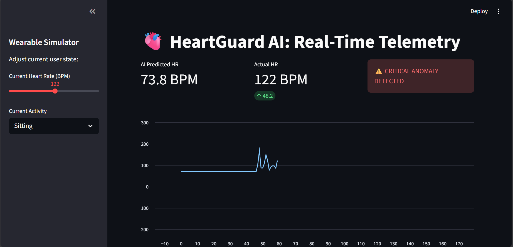

# 🫀 HeartGuard AI

**Real-Time Heart Rate Anomaly Detection System**

HeartGuard AI is an intelligent health monitoring system that uses deep learning (LSTM neural networks) to detect anomalies in heart rate patterns in real-time. The system analyzes 60 minutes of historical heart rate and activity data to predict expected heart rate values and identify potential health issues.

## ✨ Features

- **Real-Time Anomaly Detection**: Continuously monitors heart rate patterns and detects deviations
- **LSTM-Based Prediction**: Uses a trained Long Short-Term Memory neural network for accurate predictions
- **Three-Tier Alert System**:
  - 🟢 **Normal**: Heart rate within expected range
  - 🟡 **WARNING**: Moderate deviation detected (>10 BPM difference)
  - 🔴 **CRITICAL_ANOMALY**: Severe deviation detected (>20 BPM difference)
- **RESTful API**: FastAPI-based backend for easy integration
- **Interactive Dashboard**: Streamlit-based web interface for real-time monitoring
- **Docker Support**: Containerized deployment for easy setup
- **Comprehensive Testing**: Unit tests for API endpoints and prediction logic

## 📸 Screenshots

### Dashboard Interface



The interactive dashboard provides real-time monitoring with:
- **Wearable Simulator**: Adjust heart rate and activity level to test the system
- **Live Metrics**: View AI-predicted heart rate vs actual heart rate
- **Anomaly Detection**: Visual alerts for WARNING and CRITICAL_ANOMALY statuses
- **Heart Rate Chart**: Real-time visualization of heart rate trends over time

## 🏗️ Architecture

```
HeartGuard AI
├── Backend API (FastAPI)
│   ├── LSTM Model (PyTorch)
│   ├── Data Preprocessing (Scikit-learn)
│   └── REST Endpoints
├── Dashboard (Streamlit)
│   ├── Real-time Visualization
│   └── Wearable Device Simulator
└── Model Artifacts
    ├── Trained LSTM Model
    └── Feature Scaler
```

## 📋 Prerequisites

- Python 3.11 or higher
- pip (Python package manager)
- Docker (optional, for containerized deployment)

## 🚀 Installation

### Option 1: Local Installation

1. **Clone the repository** (or navigate to the project directory):
   ```bash
   cd HEARTGUARD_AI
   ```

2. **Create a virtual environment** (recommended):
   ```bash
   python -m venv .venv
   ```

3. **Activate the virtual environment**:
   - On Windows:
     ```bash
     .venv\Scripts\activate
     ```
   - On Linux/Mac:
     ```bash
     source .venv/bin/activate
     ```

4. **Install dependencies**:
   ```bash
   pip install -r requirements.txt
   ```

5. **Verify artifacts are present**:
   Ensure the `artifacts/` directory contains:
   - `health_model_v2.pth` (trained LSTM model)
   - `health_scaler.pk1` (feature scaler)

### Option 2: Docker Installation

1. **Build the Docker image**:
   ```bash
   docker build -t heartguard-ai .
   ```

2. **Run the container**:
   ```bash
   docker run -p 8000:8000 heartguard-ai
   ```

## 💻 Usage

### Starting the API Server

1. **Activate your virtual environment** (if using local installation)

2. **Start the FastAPI server**:
   ```bash
   uvicorn main:app --reload
   ```

   The API will be available at:
   - API: `http://localhost:8000`
   - Interactive Docs: `http://localhost:8000/docs`
   - Alternative Docs: `http://localhost:8000/redoc`

### Starting the Dashboard

1. **In a new terminal**, activate your virtual environment

2. **Start the Streamlit dashboard**:
   ```bash
   streamlit run dashboard.py
   ```

   The dashboard will open in your browser at `http://localhost:8501`

3. **Use the sidebar controls** to simulate wearable device data:
   - Adjust heart rate (40-200 BPM)
   - Select activity level (Sitting, Walking, Running)
   - Monitor real-time predictions and alerts

### API Usage

#### Endpoint: `POST /analyze`

Analyzes 60 minutes of heart rate and activity data to detect anomalies.

**Request Body**:
```json
{
  "history": [
    {
      "heart_rate": 70.0,
      "activity_level": 0.0
    },
    // ... 59 more entries (total 60 required)
  ]
}
```

**Parameters**:
- `heart_rate` (float): Heart rate in beats per minute (BPM)
- `activity_level` (float): Activity level where:
  - `0.0` = Sitting/Resting
  - `1.0` = Walking
  - `2.0` = Running

**Response**:
```json
{
  "status": "Normal",
  "actual_bpm": 70.0,
  "predicted_safe_bpm": 72.3,
  "deviation": 2.3
}
```

**Status Values**:
- `"Normal"`: Deviation ≤ 10 BPM
- `"WARNING"`: Deviation > 10 BPM and ≤ 20 BPM
- `"CRITICAL_ANOMALY"`: Deviation > 20 BPM

**Example using curl**:
```bash
curl -X POST "http://localhost:8000/analyze" \
  -H "Content-Type: application/json" \
  -d '{
    "history": [
      {"heart_rate": 70.0, "activity_level": 0.0}
    ]
  }'
```

**Note**: The API requires exactly 60 data points (one per minute for the last 60 minutes).

## 🧪 Testing

Run the test suite using pytest:

```bash
pytest test_main.py -v
```

The test suite includes:
- ✅ API health check
- ✅ Normal prediction scenario
- ✅ Critical anomaly detection
- ✅ Input validation

## 📁 Project Structure

```
HEARTGUARD_AI/
├── main.py                 # FastAPI application and LSTM model
├── dashboard.py            # Streamlit dashboard interface
├── test_main.py            # Unit tests for API
├── requirements.txt        # Python dependencies
├── Dockerfile              # Docker configuration
├── .gitignore             # Git ignore rules
├── artifacts/             # Model artifacts (not in git)
│   ├── health_model_v2.pth
│   └── health_scaler.pk1
├── data/                  # Training data
│   └── health_data.csv
└── HeartGuard_Core_Engine.ipynb  # Model training notebook
```

## 🔧 Configuration

### API Configuration

The API server can be configured via command-line arguments:

```bash
uvicorn main:app --host 0.0.0.0 --port 8000 --reload
```

### Dashboard Configuration

Update the `API_URL` in `dashboard.py` if your API is running on a different host/port:

```python
API_URL = "http://localhost:8000/analyze"
```

## 📦 Dependencies

Key dependencies include:
- **FastAPI**: Modern web framework for building APIs
- **PyTorch**: Deep learning framework for LSTM model
- **Streamlit**: Dashboard and visualization
- **Scikit-learn 1.6.1**: Data preprocessing and scaling (version pinned for model compatibility)
- **NumPy**: Numerical computations
- **Pydantic**: Data validation
- **Uvicorn**: ASGI server

See `requirements.txt` for the complete list with versions.

## 🐳 Docker Deployment

### Build and Run

```bash
# Build the image
docker build -t heartguard-ai .

# Run the container
docker run -p 8000:8000 heartguard-ai
```

### Docker Compose (Optional)

Create a `docker-compose.yml` for easier management:

```yaml
version: '3.8'
services:
  api:
    build: .
    ports:
      - "8000:8000"
    volumes:
      - ./artifacts:/app/artifacts
```

## 🔍 Model Details

- **Architecture**: LSTM (Long Short-Term Memory) Neural Network
- **Input Size**: 2 features (heart_rate, activity_level)
- **Hidden Size**: 50 units
- **Output Size**: 1 (predicted heart rate)
- **Sequence Length**: 60 time steps (60 minutes)
- **Training**: See `HeartGuard_Core_Engine.ipynb` for training details

## ⚠️ Important Notes

1. **Data Requirements**: The API requires exactly 60 minutes of historical data (60 data points)
2. **Model Artifacts**: Ensure `artifacts/` directory contains the trained model and scaler files
3. **Scikit-learn Version**: The scaler was pickled with scikit-learn 1.6.1. Ensure you install the exact version specified in `requirements.txt` to avoid version mismatch warnings. If you see warnings, run:
   ```bash
   pip install --upgrade -r requirements.txt
   ```
4. **Production Use**: This is a demonstration system. For production use, consider:
   - Additional security measures
   - Authentication and authorization
   - Rate limiting
   - Logging and monitoring
   - Model versioning
   - Data persistence

## 🤝 Contributing

Contributions are welcome! Please feel free to submit a Pull Request.

## 📝 License

[Apache 2.0 License]

## 👤 Author

[NICANOR NICOLAS/CleanTech-PRO.org]

## 🙏 Acknowledgments

- Built with FastAPI, PyTorch, and Streamlit
- Model trained using health monitoring datasets

---

**⚠️ Medical Disclaimer**: This system is for demonstration purposes only and should not be used as a substitute for professional medical advice, diagnosis, or treatment. Always seek the advice of qualified health providers with any questions regarding a medical condition.

